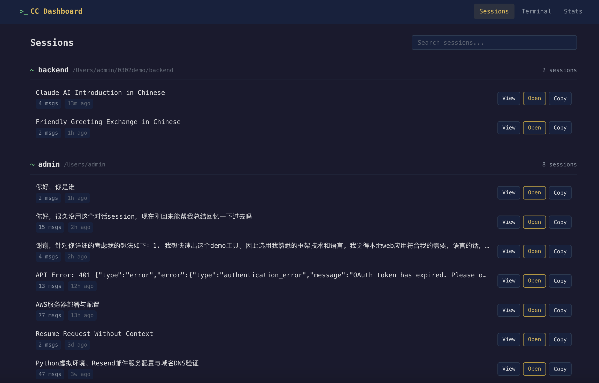
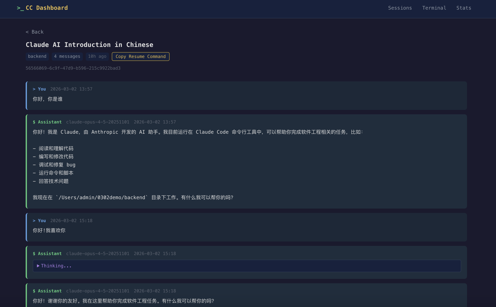
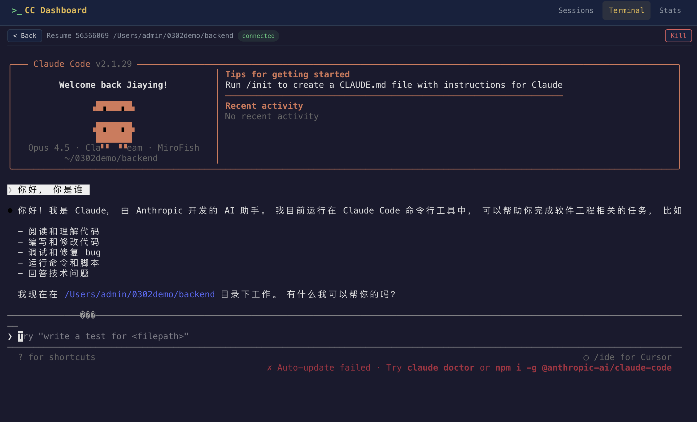
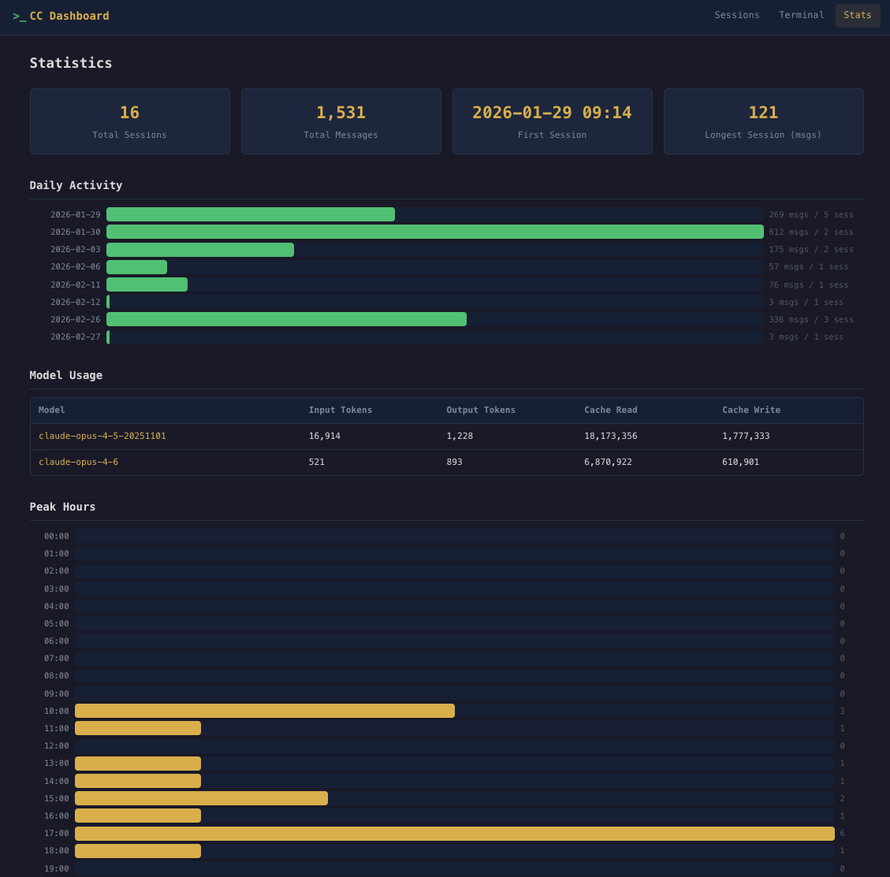

# Claude Code Dashboard

Local web app for browsing and managing [Claude Code](https://docs.anthropic.com/en/docs/claude-code) sessions.

- Browse all sessions grouped by project
- View full conversation history (thinking/tool_use blocks collapsible)
- Interactive terminal: create new Claude sessions or resume existing ones directly in the browser
- Search sessions by title/summary
- Usage statistics (daily activity, model usage, peak hours)
- One-click copy of `claude --resume` commands

## Screenshots

Terminal-style dark theme. Reads directly from `~/.claude/` (read-only).

### Sessions

Browse all sessions grouped by project, with search and one-click resume.



### Session Detail

Full conversation view with collapsible thinking and tool_use blocks.



### Interactive Terminal

Create new Claude sessions or resume existing ones directly in the browser via xterm.js.



### Statistics

Daily activity, model usage, and peak hours — all rendered with pure CSS bar charts.



## Quick Start

### Using uv (recommended)

```bash
git clone https://github.com/pattypoem/claude-code-dashboard.git
cd claude-code-dashboard
uv sync
uv run claude-code-dashboard
```

### Using pip

```bash
git clone https://github.com/pattypoem/claude-code-dashboard.git
cd claude-code-dashboard
python3 -m venv venv
venv/bin/pip install -r requirements.txt
venv/bin/python run.py
```

Open http://127.0.0.1:5050

## Requirements

- Python 3.10+
- Flask 3.0+
- Claude Code installed locally (the app reads `~/.claude/` data)

## Project Structure

```
app/
├── __init__.py          # Flask app factory + SocketIO init
├── config.py            # Paths, port configuration
├── routes.py            # HTTP routes (dashboard, session, stats, terminal, API)
├── data.py              # Data layer: reads ~/.claude/ files with mtime caching
├── models.py            # Dataclasses: Session, Project, Message, Stats
├── events.py            # SocketIO events for interactive terminal
├── terminal.py          # PTY management for terminal sessions
├── filters.py           # Jinja2 filters (timeago, formatting)
├── templates/           # Jinja2 templates
└── static/              # CSS, JS, vendor libs (xterm.js, socket.io)
```

## Configuration

| Env Variable | Default | Description |
|---|---|---|
| `CLAUDE_HOME` | `~/.claude` | Path to Claude Code data directory |
| `CC_DASHBOARD_PORT` | `5050` | Server port |

## License

MIT
